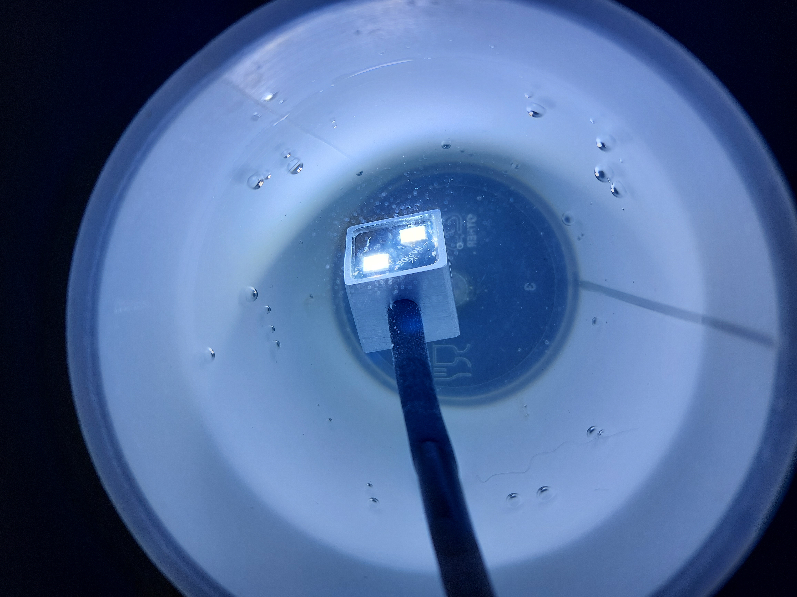

# Project Photo Gallery

This folder contains photos documenting the development of the **Underwater Dimmable LED** project from early machining and prototypes to final assembly and underwater testing.

---

## Machining

<table>
  <tr>
    </td>
    <td align="center">
      
    </td>
    <td align="center">
      
    </td>
  </tr>
</table>

<table>
  <tr>
    <td align="center">
      
    </td>
    <td align="center">
      
    </td>
  </tr>
</table>

---

## PCB & Electronics

<table>
  <tr>
    <td align="center">
       
    </td>
    <td align="center">
       
    </td>
  </tr>
</table>

---

## Prototype

<table>
  <tr>
    <td align="center">
       
    </td>
    <td align="center">
       
    </td>
  </tr>
</table>

<table>
  <tr>
    <td align="center">
       
      Prototype front detail
    </td>
    <td align="center">
       
      Prototype front variant
    </td>
  </tr>
</table>

---

## Epoxy Potting & Sealing

<table>
  <tr>
    <td align="center">
       
    </td>
    <td align="center">
       
    </td>
  </tr>
</table>

---

## Final Assembly

<table>
  <tr>
    <td align="center">
       
    </td>
  </tr>
</table>

---

## Testing & Validation

<table>
  <tr>
    <td align="center">
       
    </td>
    <td align="center">
       
    </td>
    <td align="center">
       
    </td>
  </tr>
</table>

