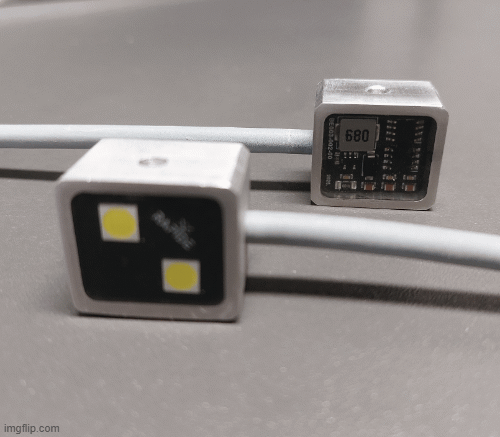
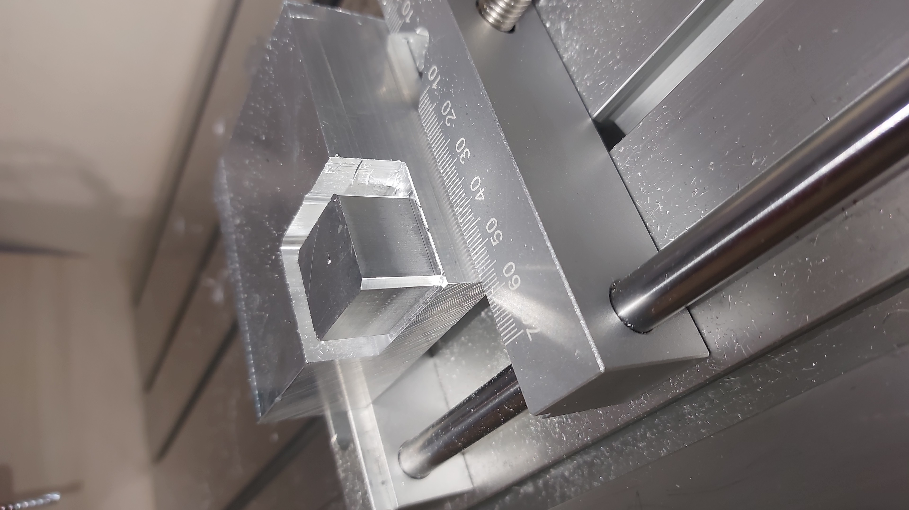
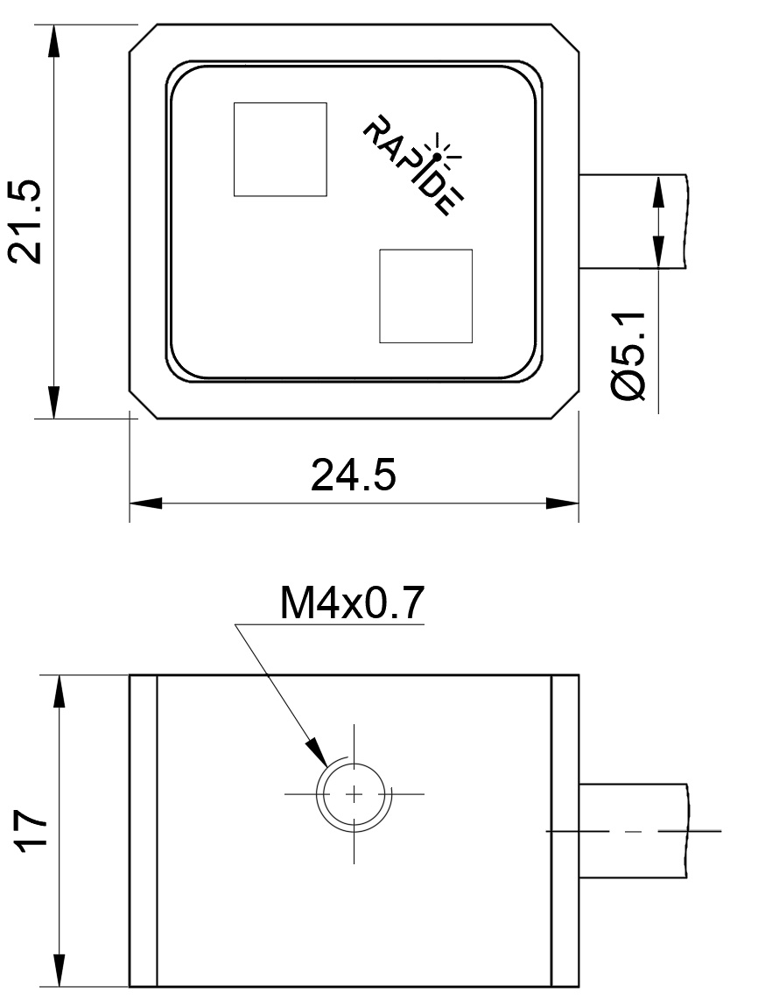
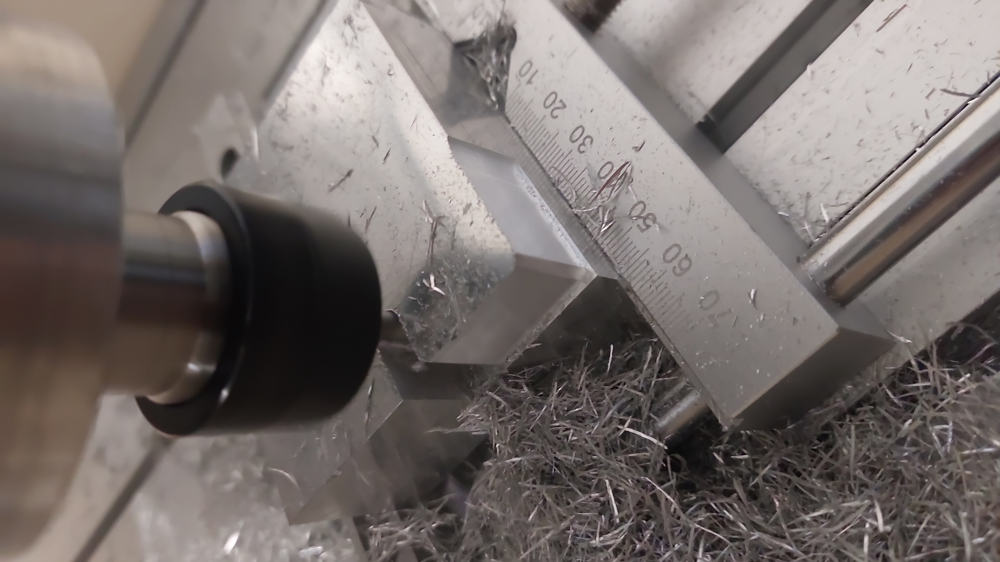
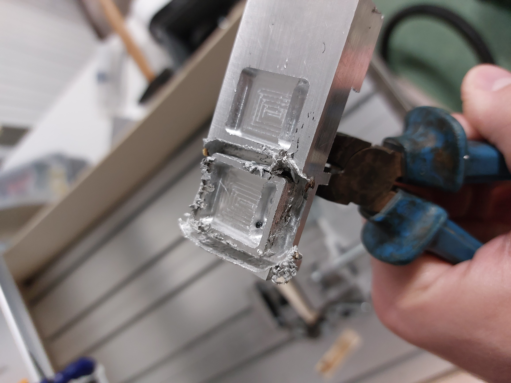

# Underwater Dimmable LED

  

<table>
  <tr>
    <td width="45%" valign="top">

### Key Information

- **Colour Temperature:** 5000 K  
- **Input Voltage:** 12–40 V DC  
- **Max. Power Consumption:** 9 W  
- **Luminosity:** ~1700 lm 
- **Brightness Control:** Servo PWM signal  
- **Mounting:** M4 threaded mounting hole  

    </td>
    <td width="55%" align="center">
      
    </td>
  </tr>
</table>

---

## Overview

The **Underwater Dimmable LED** is a compact, high-power lighting module designed specifically for underwater applications.  
LED brightness is controlled using a standard servo/PWM signal, allowing easy integration with RC systems and microcontrollers.

All electronics are fully **encapsulated in epoxy**, providing electrical insulation and protection against water ingress.  
When no control signal is present, the LED operates at approximately 1% output power.

  

---

## Mechanical & Construction Details

### Housing

The housing is machined from 6061 aluminum, providing good mechanical strength and thermal conductivity.

<table>
  <tr>
    <td align="center">
       
      Milling process
    </td>
    <td align="center">
       
      Finished housings
    </td>
  </tr>
</table>

---

### Electronics

The PCB and all electronic components are **fully potted in epoxy** and connected using shielded high-performance PUR cable, ensuring mechanical robustness and resistance to harsh environments.

<table>
  <tr>
    <td align="center">
       
      Backside
    </td>
    <td align="center">
       
      Frontside
    </td>
  </tr>
</table>

---

### Mounting & Dimensions

The module is mounted using an M4 threaded hole.  
Mechanical dimensions are shown below.

  

---

## Repository Structure

### Firmware
Firmware for the STM32 microcontroller.

### Hardware
PCB design related documentation.

### Photos
Project images, the joys of machining process and testing.

<table>
  <tr>
    <td align="center">
       
      Making chips
    </td>
    <td align="center">
       
      Eating chips
    </td>
  </tr>
</table>